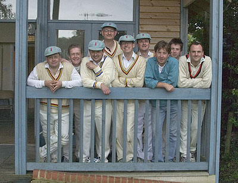

# {{page.game}}

Played at {{page.location}} on {{page.date}}

{{page.report}}

**Result:** {{page.result}}

R Earney's 21st 50

## The Min Innings

| Batsman | Dismissal |  | Runs |
|:---|:---|---|---:|
| **R Earney** | c R Rose | J Lapham | 64 |
| **S Barrowcliff** | b | S Snook | 8 |
| **R Beswick &#42;** | run out |  | 9 |
| **H Ingham** | c S Snook | J Lapham | 38 |
| **B Hopewell** | b | J Lapham | 5 |
| **W Calvert** | b | J Lapham | 0 |
| **A Gallagher** | not out |  | 14 |
| **A Slight** | not out |  | 12 |
| **J Grant &#8224;** | dnb |  |  |
| **J Wright** | dnb |  |  |
|  |  |  |  |
| **Extras** | | (4b 6lb 10w 3nb) | 23 |
| **Total** | | (32 overs) | 173 for 6 wkts |

## Fall of Wickets

| | 1 | 2 | 3 | 4 | 5 | 6 | 7 | 8 | 9 | 10 |
|---|:---:|:---:|:---:|:---:|:---:|:---:|:---:|:---:|:---:|:---:|
| **Score** | 44 | 78 | 135 | 143 | 143 | 143 |  |  |  |  |
| **Batsman** | 2 | 3 | 1 | 4 | 5 | 7 |  |  |  |  |

## Bowling

| | O | M | R | W |
|---|:---|:---|:---|:---|
| **Watermeyer** | 7 | 2 | 23 | 0 |
| **S Snook** | 9 | 3 | 14 | 3 |
| **Read** | 10 | 0 | 39 | 3 |
| **G Barton** | 7 | 0 | 32 | 1 |
| **J Lapham** | 7 | 0 | 32 | 1 |
| **K Dix** | 7 | 0 | 32 | 1 |
| **C Spencer** | 7 | 0 | 32 | 1 |

## {{page.title}} Innings

| Batsman | Dismissal |  | Runs |
|:---|:---|---|---:|
| **F Barton** | not out |  | 37 |
| **K Dix** | lbw | R Beswick | 0 |
| **G Barton** | run out |  | 0 |
| **Mills** | c H Ingham | J Wright | 9 |
| **J Lapham** | b | J Wright | 3 |
| **Andreas** | b | H Ingham  | 15 |
| **R Rose &#8224;** | b | H Ingham | 3 |
| **R Lapham** | c J Grant | H Ingham | 4 |
| **C Spencer** | not out |  |  |
| **S Snook** | dnb |  |  |
|  |  |  |  |
| **Extras** | | (1b 0lb 1w 1nb) | 3 |
| **Total** | | (21 overs) | 74 for 7 wkts |

## Fall of Wickets

| | 1 | 2 | 3 | 4 | 5 | 6 | 7 | 8 | 9 | 10 |
|---|:---:|:---:|:---:|:---:|:---:|:---:|:---:|:---:|:---:|:---:|
| **Score** | 3 | 6 | 26 |  |  |  |  |  |  |  |
| **Batsman** | 2 | 3 | 4 | 5 | 6 | 7 | 8 |  |  |  |

## Bowling

| | O | M | R | W |
|---|:---|:---|:---|:---|
| **R Beswick** | 4 | 1 | 11 | 1 |
| **W Calvert** | 1 | 0 | 5 | 0 |
| **J Wright** | 6 | 1 | 31 | 2 |
| **R Earney** | 3 | 0 | 12 | 0 |
| **H Ingham** | 4 | 1 | 7 | 3 |
| **B Hopewell** | 3 | 0 | 11 | 0 |

## Win/Loss Ratio

| Won | Lost | Drawn | Tied |
|:---|:---|:---|---:|
| 4 | 2 | 1 | 0 |