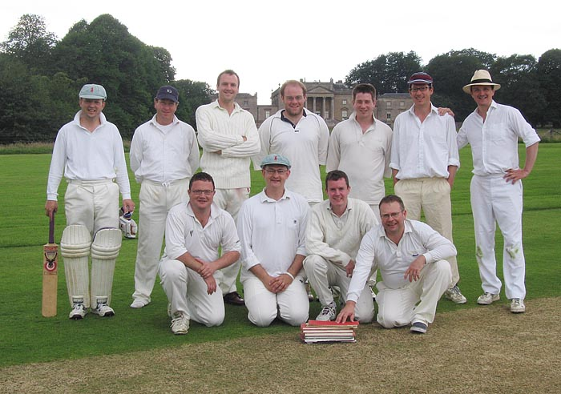

# {{page.game}}

Played at {{page.location}} on {{page.date}}

{{page.report}}

**Result:** {{page.result}}

R Earney's 28th 50

## {{page.title}} Innings

| Batsman | Dismissal |  | Runs |
|:---|:---|---|---:|
| **Heyes** | c | H Ingham | 46 |
| **J Lapham** | b | H Ingham | 29 |
| **R Rose** | b | R Earney | 51 |
| **B Hopewell** | b | R Earney | 23 |
| **C Spencer** | not out |  | 3 |
| **Norman** | not out |  | 2 |
| **S Snook** | dnb |  |  |
| **Churchill** | dnb |  |  |
|  |  |  |  |
|  |  |  |  |
|  |  |  |  |
| **Extras** | | (5b 11lb 9w 9nb) | 34 |
| **Total** | | (35 overs) | 176 for 4 wkts |

## Fall of Wickets

| | 1 | 2 | 3 | 4 | 5 | 6 | 7 | 8 | 9 | 10 |
|---|:---:|:---:|:---:|:---:|:---:|:---:|:---:|:---:|:---:|:---:|
| **Score** | 78 | 85 | 132 | 173 |  |  |  |  |  |  |
| **Batsman** | 1 | 2 | 4 |  3|  |  |  |  |  |  |

## Bowling

| | O | M | R | W |
|---|:---|:---|:---|:---|
| **G Powell** | 7 | 0 | 39 | 0 |
| **R Beswick** | 6 | 0 | 19 | 0 |
| **J Wright** | 7 | 0 | 26 | 0 |
| **H Ingham** | 7 | 0 | 24 | 2 |
| **J Kenny** | 3 | 0 | 22 | 0 |
| **R Earney** | 5 | 0 | 28 | 2 |

## The Min Innings

| Batsman | Dismissal |  | Runs |
|:---|:---|---|---:|
| **R Earney** | c B Hopewell | Churchill | 55 |
| **S Barrowcliff** | lbw | S Snook | 18 |
| **J Kenny** | b | C Spencer | 10 |
| **W Calvert** | b | C Spencer | 19 |
| **R Coyle** | lbw | B Hopewell | 2 |
| **H Ingham** | not out |  | 27 |
| **R Beswick** | b | B Hopewell | 21 |
| **J Grant** | lbw | J Lapham | 11 |
| **A Slight** | b | B Hopewell | 2 |
| **G Powell** | not out |  | 3 |
| **J Wright** | dnb |  |  |
| **Extras** | | (4b 4lb 19w 1nb) | 28 |
| **Total** | | (34 overs) | 177 for 8 wkts |

## Fall of Wickets

| | 1 | 2 | 3 | 4 | 5 | 6 | 7 | 8 | 9 | 10 |
|---|:---:|:---:|:---:|:---:|:---:|:---:|:---:|:---:|:---:|:---:|
| **Score** | 63 | 94 | 113 | 113 | 127 | 155 | 166 | 171 |  |  |
| **Batsman** | 2 | 3 | 1 | 5 | 4 | 7 | 8 | 9 |  |  |

## Bowling

| | O | M | R | W |
|---|:---|:---|:---|:---|
| **Norman** | 7 | 0 | 29 | 0 |
| **S Snook** | 7 | 1 | 31 | 1 |
| **Spencer** | 4 | 0 | 18 | 1 |
| **C Churchill** | 7 | 0 | 39 | 2 |
| **B Hopewell** | 6 | 0 | 38 | 2 |
| **J Lapham** | 3 | 0 | 14 | 1 |

## Win/Loss Ratio

| Won | Lost | Drawn | Tied |
|:---|:---|:---|---:|
| 4 | 3 | 2 | 0 |

[Next game:]({{page.next}})