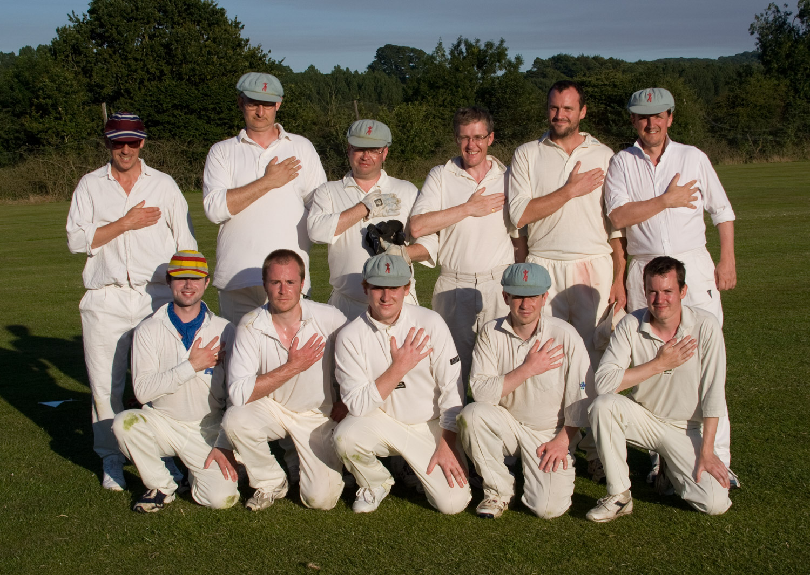

# {{page.game}}

Played at {{page.location}} on {{page.date}}

{{page.report}}

**Result:** {{page.result}}

R Earney's 33rd 50. R Beswick's 20th 50. P O'Mahony 45 off 18 balls for his highest score

## The Min Innings

| Batsman | Dismissal |  | Runs |
|:---|:---|---|---:|
| **J Grant &#8224;** | b | J Oborne | 0 |
| **A Gallagher** | b | R Gunning | 4 |
| **R Coyle** | b | A Hilleary | 17 |
| **H Ingham** | b | R Gunning | 0 |
| **R Beswick &#42;** | not out |  | 50 |
| **R Earney** | b | J Oborne | 56 |
| **P Beswick** | b | A Hilleary | 6 |
| **A Slight** | c C O'Connor | A Hilleary | 0 |
| **T Rutherford** | st C O'Connor | R Gunning | 31 |
| **P O'Mahony** | not out |  | 45 |
| **J Wright** | dnb |  |  |
| **Extras** | | (8b 4lb 10w 0nb 0p) | **22** |
| **Total** | | (40 overs) | **232 for 8 wkts** |

## Fall of Wickets

| | 1 | 2 | 3 | 4 | 5 | 6 | 7 | 8 | 9 | 10 |
|---|:---:|:---:|:---:|:---:|:---:|:---:|:---:|:---:|:---:|:---:|
| **Score** | 4 | 4 | 5 | 38 | 115 | 122 | 122 | 183 |  |  |
| **Batsman** | 2 | 1 | 4 | 3 | 6 | 7 | 8 | 9 |  |  |

## Bowling

| | O | M | R | W |
|---|:---|:---|:---|:---|
| **J Oborne** | 12 | 6 | 39 | 2 |
| **R Gunning** | 7 | 0 | 36 | 3 |
| **A Hilleary** | 13 | 1 | 84 | 3 |
| **S Burgoyne-Lock** | 6 | 0 | 44 | 0 |
| **Stern** | 2 | 0 | 26 | 0 |

## {{page.title}} Innings

| Batsman | Dismissal |  | Runs |
|:---|:---|---|---:|
| **C O'Connor** | c H Ingham | J Wright | 32 |
| **Stern** | b | H Ingham | 6 |
| **Jones** | c J Grant | P O'Mahony | 0 |
| **A Hilleary** | not out |  | 115 |
| **J Oborne** | not out |  | 45 |
| **R Gunning** | dnb |  |  |
| **S Burgoyne-Lock** | dnb |  |  |
|  |  |  |  |
|  |  |  |  |
|  |  |  |  |
|  |  |  |  |
| **Extras** | | (0b 0lb 0w 0nb 0p) | **16** |
| **Total** | | (39 overs) | **214 for 3 wkts** |

## Fall of Wickets

| | 1 | 2 | 3 | 4 | 5 | 6 | 7 | 8 | 9 | 10 |
|---|:---:|:---:|:---:|:---:|:---:|:---:|:---:|:---:|:---:|:---:|
| **Score** |  |  |  |  |  |  |  |  |  |  |
| **Batsman** |  |  |  |  |  |  |  |  |  |  |

## Bowling

| | O | M | R | W |
|---|:---|:---|:---|:---|
| **H Ingham** | 8 | 0 | 38 | 1 |
| **P O'Mahony** | 5 | 0 | 20 | 1 |
| **J Wright** | 15 | 0 | 74 | 1 |
| **A Slight** | 4 | 0 | 32 | 0 |
| **R Earney** | 3 | 0 | 20 | 0 |
| **T Rutherford** | 6 | 0 | 29 | 0 |

## Win/Loss Ratio

| Won | Lost | Drawn | Tied |
|:---|:---|:---|---:|
| 4 | 5 | 1 | 0 |

[Next game:]({{page.next}})