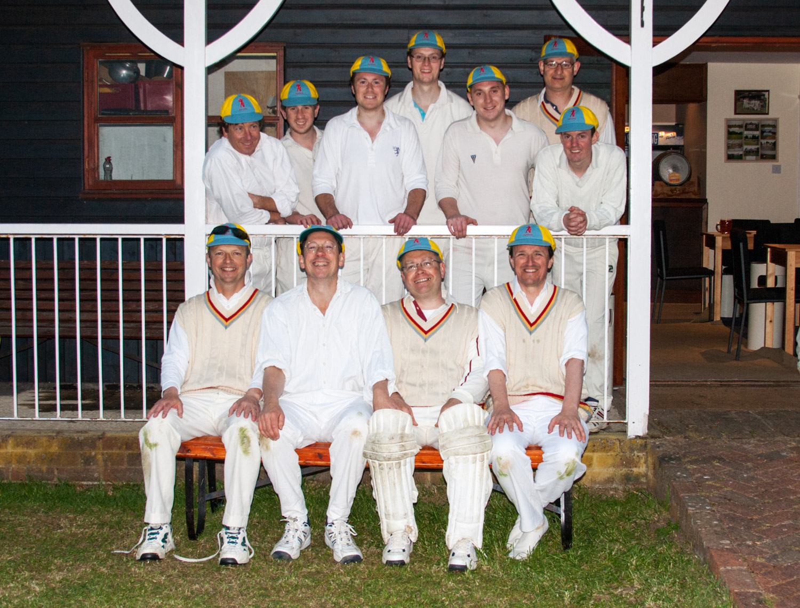

# {{page.game}}

Played at {{page.location}} on {{page.date}}

{{page.report}}

**Result:** {{page.result}}

## The Min Innings

| Batsman | Dismissal |  | Runs |
|:---|:---|---|---:|
| **R Earney** | b | N Lawrence | 54 |
| **S Barrowcliff** | b | S Symes | 42 |
| **R Beswick &#42;** | b | S Symes | 0 |
| **T Rutherford** | c | N Lawrence | 8 |
| **P Wigg** | not out |   | 47 |
| **A Slight** | b | D Bloomfield | 5 |
| **W Calvert** | b | N Lawrence | 0 |
| **J Grant &#8224;** | run out |  | 5 |
| **R Coyle** | not out |  | 0 |
| **P Beswick** | dnb |  |  |
| **J Wright** | dnb |  |  |
| **Extras** | | (35b 2lb 15w 0nb 0p) | 52 |
| **Total** | | (46 overs) | 212 for 7 wkts |

## Fall of Wickets

| | 1 | 2 | 3 | 4 | 5 | 6 | 7 | 8 | 9 | 10 |
|---|:---:|:---:|:---:|:---:|:---:|:---:|:---:|:---:|:---:|:---:|
| **Score** | **105** | 105 | 123 | 142 | 145 | 168 | 200 |  |  |  |
| **Batsman** | 2 | 3 | 1 | 4 | 6 | 7 | 8 |  |  |  |

## Bowling

| | O | M | R | W |
|---|:---|:---|:---|:---|
| **C McKnd** | 6 | 1 | 29 | 0 |
| **N Humphries** | 7 | 1 | 23 | 0 |
| **S Symes** | 10 | 2 | 29 | 2 |
| **N Lawrence** | 12 | 4 | 28 | 3 |
| **A Worman** | 6 | 1 | 30 | 0 |
| **A Bloomfield** | 3 | 0 | 14 | 1 |
| **B Tyler** | 2 | 0 | 19 | 0 |

## {{page.title}} Innings

| Batsman | Dismissal |  | Runs |
|:---|:---|---|---:|
| **J Chittenden** | c & b | T Rutherford | 68 |
| **A Bloomfield** | c | T Rutherford | 4 |
| **B Tyler** | b | P Wigg | 26 |
| **A Warman** | lbw | T Rutherford | 29 |
| **D Bloomfield** | b | P Wigg | 08 |
| **T Tomblin** | b | P Wigg  | 0 |
| **S Symes** | c J Grant | P Wigg | 2 |
| **N Humphries** | b | T Rutherford | 0 |
| **N Lawrence** | b | T Rutherford | 8 |
| **D Ewan** | run out |  | 13 |
| **C McKnd** | not out |  | 8 |
| **Extras** | | (12b 9lb 13w 1nb 0p) | 35 |
| **Total** | | (37.1 overs) | 205 all out |

## Fall of Wickets

| | 1 | 2 | 3 | 4 | 5 | 6 | 7 | 8 | 9 | 10 |
|---|:---:|:---:|:---:|:---:|:---:|:---:|:---:|:---:|:---:|:---:|
| **Score** |  |  |  |  |  |  |  | 168 | 188 | 205 |
| **Batsman** |  |  |  |  |  |  |  | 7 | 9 | 10 |

## Bowling

| | O | M | R | W |
|---|:---|:---|:---|:---|
| **T Rutherford** | 12 | 2 | 49 | 5 |
| **R Beswick** | 5.1 | 1 | 24 | 0 |
| **J Wright** | 5 | 0 | 15 | 0 |
| **P Wigg** | 12 | 0 | 47 | 4 |
| **P Beswick** | 2 | 0 | 18 | 0 |
| **R Earney** | 1 | 0 | 2 | 0 |

## Win/Loss Ratio

| Won | Lost | Drawn | Tied |
|:---|:---|:---|---:|
| 1 | 0 | 0 | 0 |