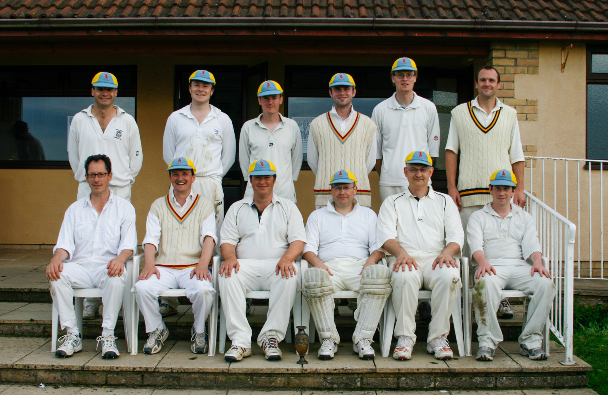

# {{page.game}}

Played at {{page.location}} on {{page.date}}

{{page.report}}

**Result:** {{page.result}}

## The Min Innings

| Batsman | Dismissal |  | Runs |
|:---|:---|---|---:|
| **R Earney** | b | R Young | 43 |
| **J Grant &#8224;** | st D Garland | R Young | 17 |
| **R Beswick &#42;** | c T Hill | T Knight | 17 |
| **P Wigg** | c S Andrews | L Whitlock | 15 |
| **R Coyle** | b | L Whitlock | 7 |
| **H Ingham** | c R Young | T Knight | 0 |
| **P Grant** | b | T Knight | 20 |
| **A Slight** | b | S Andrews | 17 |
| **I Marshall** | not out |  | 7 |
| **T Rutherford** | c J Bray | T Knight | 5 |
| **J Wright** | not out |  | 4 |
| **Extras** | | (5b 5lb 10w 4nb 0p) | 24 |
| **Total** | | (40 overs) | 176 for 9 wkts |

## Fall of Wickets

| | 1 | 2 | 3 | 4 | 5 | 6 | 7 | 8 | 9 | 10 |
|---|:---:|:---:|:---:|:---:|:---:|:---:|:---:|:---:|:---:|:---:|
| **Score** | 63 | 73 | 98 | 110 | 111 | 114 | 140 | 156 | 168 |  |
| **Batsman** | 2 | 1 | 4 | 3 | 6 | 5 | 8 | 7 | 10 |  |

## Bowling

| | O | M | R | W |
|---|:---|:---|:---|:---|
| **T Hill** | 8 | 2 | 28 | 0 |
| **S Andrews** | 8 |03 | 39 | 1 |
| **R Young** | 8 | 1 | 23 | 2 |
| **L Whitlock** | 8 | 0 | 23 | 2 |
| **T Knight** | 6 | 0 | 47 | 4 |
| **J Pike** | 2 | 0 | 5 | 0 |

## {{page.title}} Innings

| Batsman | Dismissal |  | Runs |
|:---|:---|---|---:|
| **D Garland** | b | J Wright | 31 |
| **B Bentley** | lbw | H Ingham | 3 |
| **J Pike** | b | H Ingham | 9 |
| **D Sparks** | run out |  | 1 |
| **T Baigent** | c J Wright | P O'Mahony | 15 |
| **J Bray** | b | J Wright  | 4 |
| **R Young** | c R Earney | J Wright | 21 |
| **S Andrews** | c A Slight | P O'Mahony | 0 |
| **T Knight** | c J Wright | P Wigg | 6 |
| **T Hill** | not out |  | 2 |
| **L Whitlock** | run out |  | 0 |
| **Extras** | | (0b 3lb 0w 2nb 0p) | 5 |
| **Total** | | (33.4 overs) | 110 all out |

## Fall of Wickets

| | 1 | 2 | 3 | 4 | 5 | 6 | 7 | 8 | 9 | 10 |
|---|:---:|:---:|:---:|:---:|:---:|:---:|:---:|:---:|:---:|:---:|
| **Score** | 8 | 25 | 29 | 60 | 70 | 71 | 72 | 107 | 108 | 110 |
| **Batsman** | 2 | 3 | 4 | 5 | 1 | 6 | 8 | 7 | 9 | 11 |

## Bowling

| | O | M | R | W |
|---|:---|:---|:---|:---|
| **I Marshall** | 8 | 2 | 10 | 0 |
| **H Ingham** | 8 | 1 | 30 | 2 |
| **P O'Mahony** | 8 | 0 | 39 | 2 |
| **J Wright** | 8 | 1 | 25 | 3 |
| **P Wigg** | 1 | 0 | 1 | 1 |
| **A Slight** | 0.4 | 0 | 2 | 0 |

## Win/Loss Ratio

| Won | Lost | Drawn | Tied |
|:---|:---|:---|---:|
| 4 | 2 | 0 | 0 |

[Next game:]({{page.next}})