# {{page.game}}

Played at {{page.location}} on {{page.date}}

{{page.report}}

**Result:** {{page.result}}

25th Anniversary (and 350th) Game)

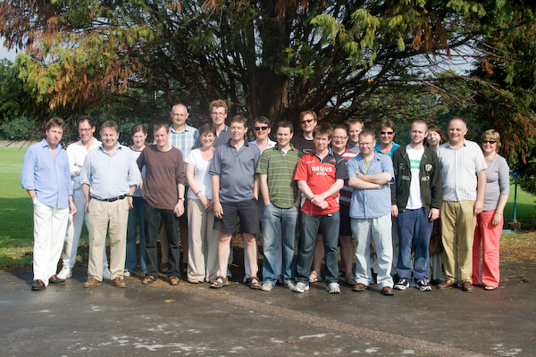

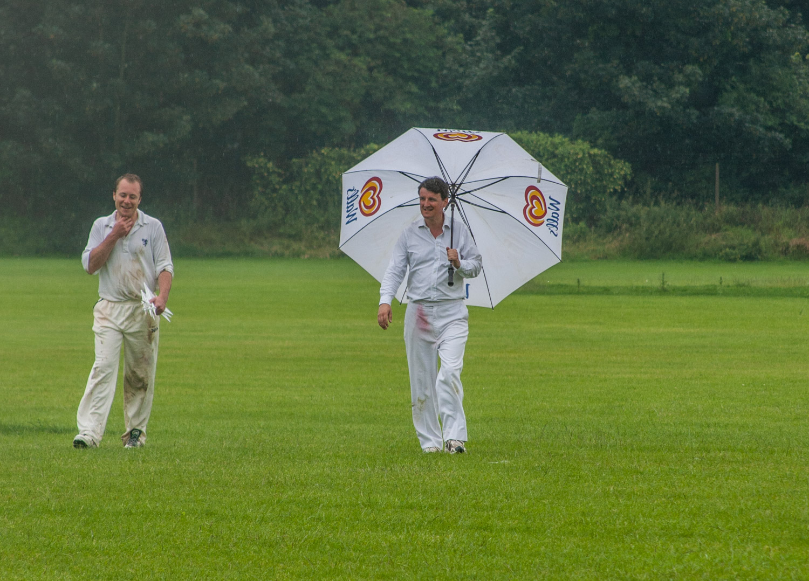

## The Young Min Innings

| Batsman | Dismissal |  | Runs |
|:---|:---|---|---:|
| **T Rutherford &#42;** | run out |  | 5 |
| **A Slight** | b | I Marshall | 9 |
| **R Coyle** | c J Grant | R Earney | 5 |
| **R Kitson &#8224;** | not out |  | 11 |
| **P Wigg** | not out |  | 0 |
| **P Beswick** | dnb |  |  |
| **A Fitzgerald** | dnb |  |  |
| **R O'Hagan** | dnb |  |  |
| **M Bates** | dnb |  |  |
| **P O'Mahony** | dnb |  |  |
|  |  |  |  |
| **Extras** | | (0b 2lb 6w 0nb 0p) | 8 |
| **Total** | | (8.2 overs) | 38 for 3 wkts |

## Fall of Wickets

| | 1 | 2 | 3 | 4 | 5 | 6 | 7 | 8 | 9 | 10 |
|---|:---:|:---:|:---:|:---:|:---:|:---:|:---:|:---:|:---:|:---:|
| **Score** | 17 | 17 | 35 |  |  |  |  |  |  |  |
| **Batsman** | 2 | 1 | 3 |  |  |  |  |  |  |  |

## Bowling

| | O | M | R | W |
|---|:---|:---|:---|:---|
| **I Marshall** | 4 | 0 | 18 | 1 |
| **R Earney** | 4 | 0 | 14 | 1 |
| **J Wright** | 0.2 | 0 | 3 | 0 |

## The Old Min Innings

| Batsman | Dismissal |  | Runs |
|:---|:---|---|---:|
| **R Earney** | dnb |  |  |
| **J Grant &#8224;** | dnb |  |  |
| **R Beswick &#42;** | dnb |  |  |
| **W Calvert** | dnb |  |  |
| **M Gardiner** | dnb |  |  |
| **P Grant** | dnb |  |  |
| **I Marshall** | dnb |  |  |
| **A Sylvester** | dnb |  |  |
| **E Garland** | dnb |  |  |
| **J Wright** | dnb |  |  |
|  |  |  |  |
| **Extras** | | (0b 0lb 0w 0nb) | 0 |
| **Total** | | (0 overs) | 0 |

## Fall of Wickets

| | 1 | 2 | 3 | 4 | 5 | 6 | 7 | 8 | 9 | 10 |
|---|:---:|:---:|:---:|:---:|:---:|:---:|:---:|:---:|:---:|:---:|
| **Score** |  |  |  |  |  |  |  |  |  |  |
| **Batsman** |  |  |  |  |  |  |  |  |  |  |

## Bowling

| | O | M | R | W |
|---|:---|:---|:---|:---|
| | | | |

## Win/Loss Ratio

| Won | Lost | Drawn | Tied |
|:---|:---|:---|---:|
| 5 | 2 | 2 | 0 |

[Next game:]({{page.next}})

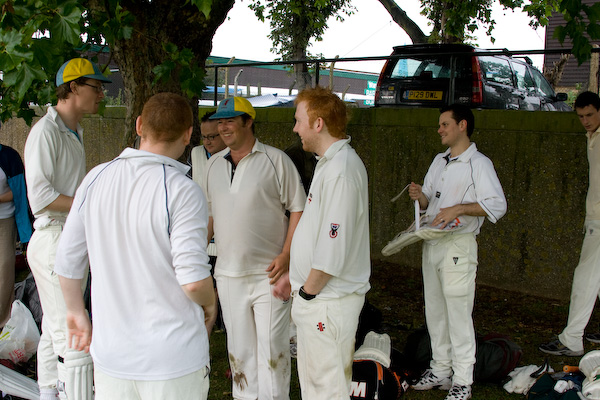

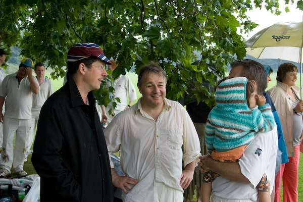

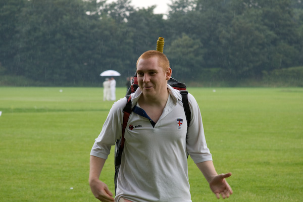

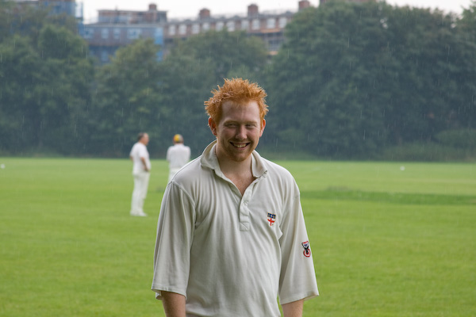

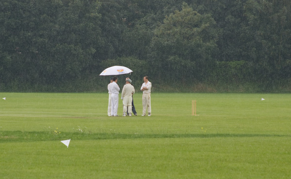

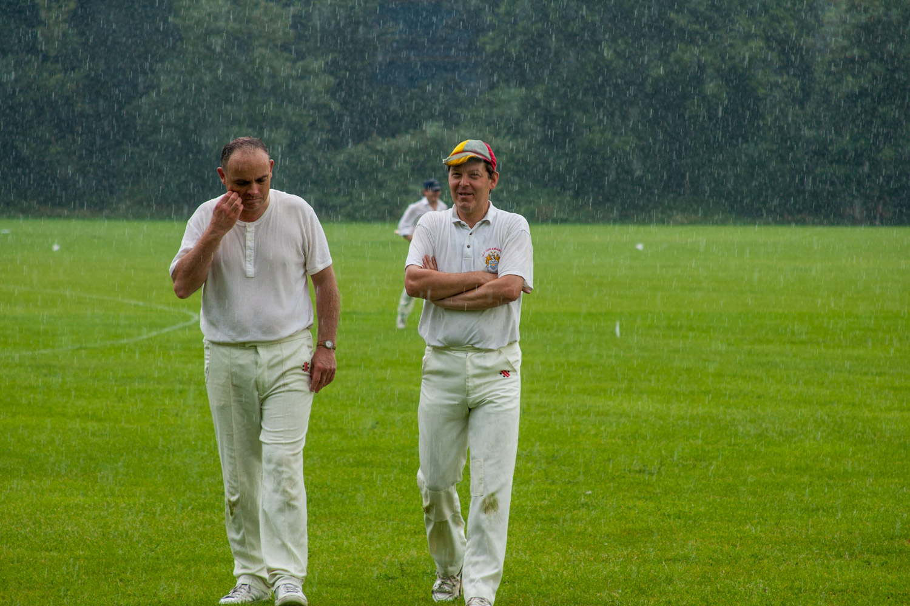

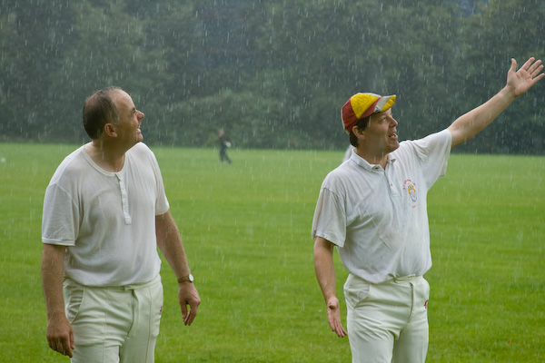

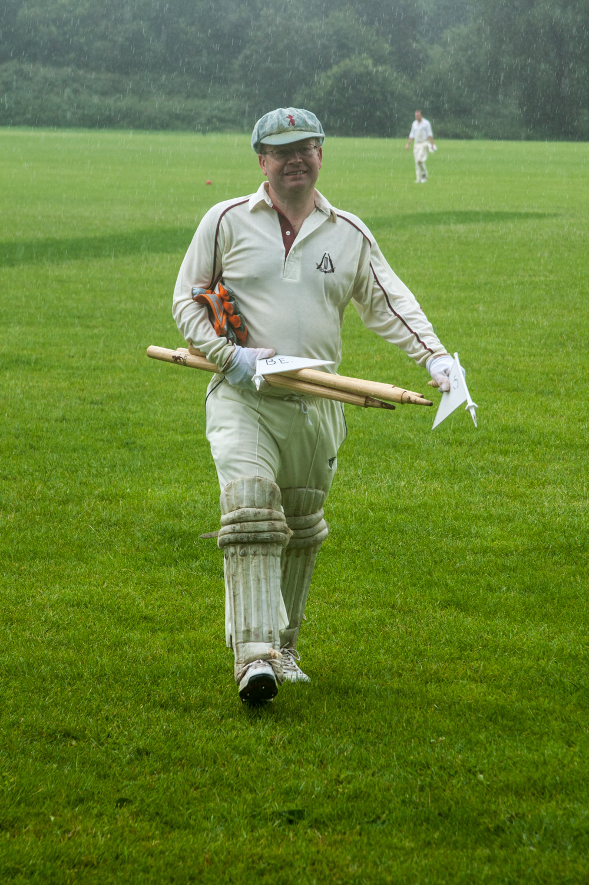

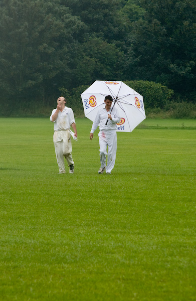

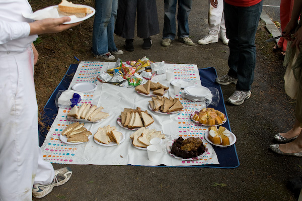