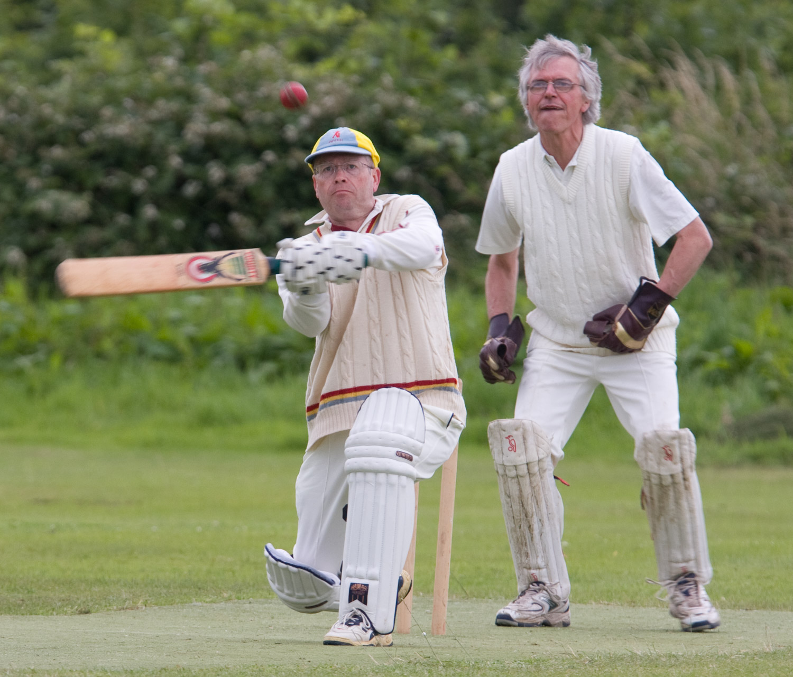
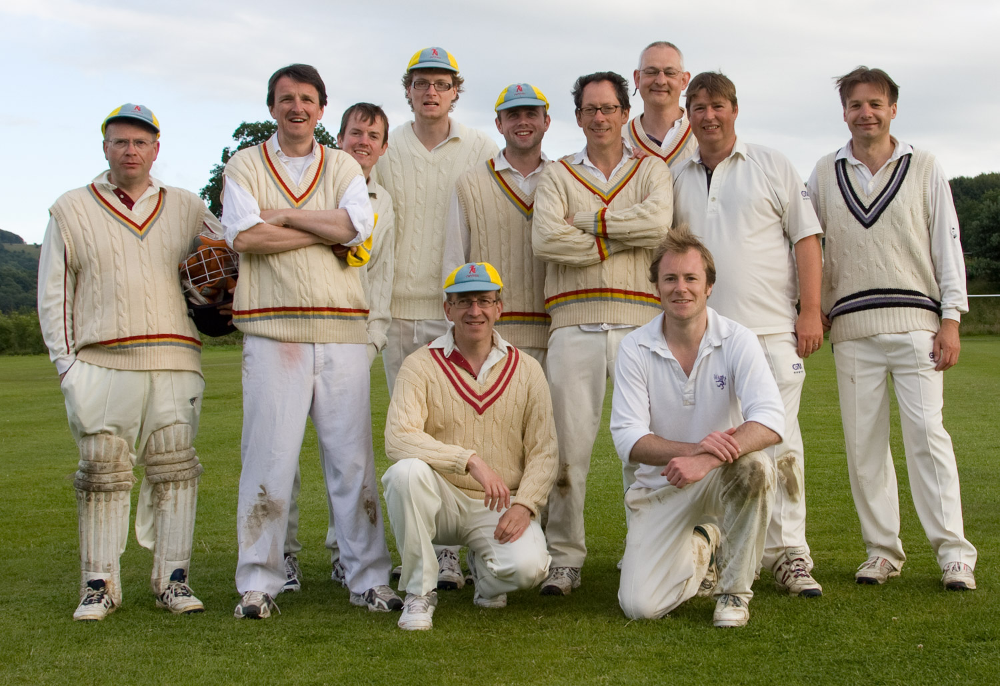

# {{page.game}}

Played at {{page.location}} on {{page.date}}

{{page.report}}

**Result:** {{page.result}}

## The Min Innings

| Batsman | Dismissal |  | Runs |
|:---|:---|---|---:|
| **R Earney** | lbw | J Oborne | 16 |
| **M Goff** | c M O'Connor | S Lock | 16 |
| **T Rutherford &#42;** | c | B White | 12 |
| **R Beswick** | c | A Reeves | 41 |
| **P Grant** | run out |  | 9 |
| **J Grant &#8224;** | c | A Reeves | 9 |
| **R Coyle** | not out |  | 3 |
| **P Wigg** | st M O'Connor | D Ware | 8 |
| **I Marshall** | run out |  | 2 |
| **J Wright** | b | B White | 22 |
| **P O'Mahony** | lbw | B White | 4 |
| **Extras** | | (1b 11lb 13w 1nb 0p) | 26 |
| **Total** | | (49 overs) | 149 all out |

## Fall of Wickets

| | 1 | 2 | 3 | 4 | 5 | 6 | 7 | 8 | 9 | 10 |
|---|:---:|:---:|:---:|:---:|:---:|:---:|:---:|:---:|:---:|:---:|
| **Score** | 33 | 58 | 62 | 107 | 114 | 121 | 134 | 141 | 143 | 149 |
| **Batsman** | 1 | 2 | 3 | 5 | 6 | 4 | 8 | 9 | 10 | 11 |

## Bowling

| | O | M | R | W |
|---|:---|:---|:---|:---|
| **A Hilleary** | 7 | 0 | 21 | 0 |
| **J Oborne** | 10 | 2 | 14 | 1 |
| **B White** | 12 | 6 | 16 | 3 |
| **S Lock** | 9 | 1 | 37 | 1 |
| **A Reeves** | 6 | 2 | 15 | 2 |
| **D Ware** | 5 | 0 | 28 | 1 |

## {{page.title}} Innings

| Batsman | Dismissal |  | Runs |
|:---|:---|---|---:|
| **M O'Connor &#8224;** | b | I Marshall | 23 |
| **D Grugeon** | b | P O'Mahony | 0 |
| **A Reeves** | lbw | J Wright | 24 |
| **A Hilleary** | b | J Wright | 12 |
| **R Stern** | c R Beswick | I Marshall | 4 |
| **O Moore** | c J Grant | J Wright  | 0 |
| **J Oborne** | lbw | J Wright | 21 |
| **B White &#42;** | c I Marshall | R Earney | 7 |
| **S Lock** | c P Wigg | R Earney |  0|
| **F Gunning** | not out |  | 0 |
| **D Ware** | not out |  | 0 |
| **Extras** | | (0b 5lb 5w 2nb 0p) | 12 |
| **Total** | | (49 overs) | 106 for 9 wkts |

## Fall of Wickets

| | 1 | 2 | 3 | 4 | 5 | 6 | 7 | 8 | 9 | 10 |
|---|:---:|:---:|:---:|:---:|:---:|:---:|:---:|:---:|:---:|:---:|
| **Score** | 1 | 48 | 65 | 67 | 67 |  |  |  |  |  |
| **Batsman** | 2 | 3 | 1 | 4 | 5 |  |  |  |  |  |

## Bowling

| | O | M | R | W |
|---|:---|:---|:---|:---|
| **P O'Mahony** | 9 | 2 | 20 | 1 |
| **P Wigg** | 7 | 1 | 23 | 0 |
| **I Marshall** | 14 | 7 | 8 | 2 |
| **J Wright** | 15 | 3 | 33 | 4 |
| **R Earney** | 3 | 1 | 10 | 2 |
| **T Rutherford** | 1 | 1 | 0 | 0 |

## Win/Loss Ratio

| Won | Lost | Drawn | Tied |
|:---|:---|:---|---:|
| 6 | 2 | 1 | 0 |

[Next game:]({{page.next}})