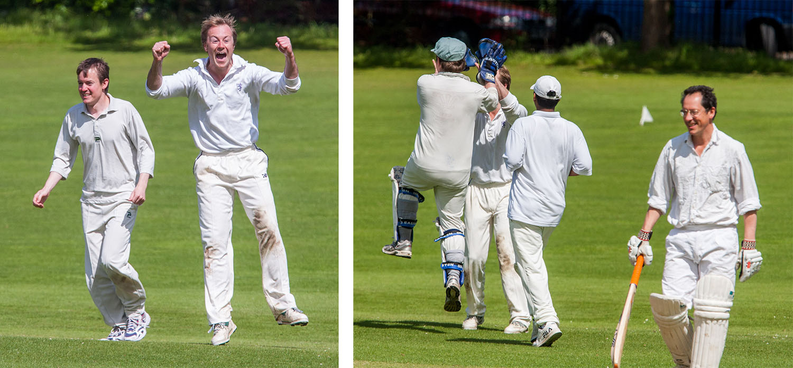

# {{page.game}}

Played at {{page.location}} on {{page.date}}

{{page.report}}

**Result:** {{page.result}}

M Goff's 6th 50

Brother fought brother for the second year in a row, but they could not be separated.

## The Old Min Innings

| Batsman | Dismissal |  | Runs |
|:---|:---|---|---:|
| **R Earney** | c A Slight | P O'Mahony | 16 |
| **M Goff** | c | T Rutherford | 61 |
| **R Beswick &#42;** | c R Coyle | P Wigg | 0 |
| **W Calvert** | lbw | M Gupta | 6 |
| **J Grant &#8224;** | lbw | I Miah | 12 |
| **R Green** | not out |  | 39 |
| **M Gardiner** | not out |  | 12 |
| **P Grant** | dnb |  |  |
| **I Marshall** | dnb |  |  |
| **E Garland** | dnb |  |  |
| **J Wright** | dnb |  |  |
| **Extras** | | (0b 1lb 14w 1nb 0p) | 16 |
| **Total** | | (43 overs) | 166 for 5 wkts |

## Fall of Wickets

| | 1 | 2 | 3 | 4 | 5 | 6 | 7 | 8 | 9 | 10 |
|---|:---:|:---:|:---:|:---:|:---:|:---:|:---:|:---:|:---:|:---:|
| **Score** | 28 | 29 | 45 | 86 | 119 |  |  |  |  |  |
| **Batsman** | 1 | 3 | 4 | 5 | 2 |  |  |  |  |  |

## Bowling

| | O | M | R | W |
|---|:---|:---|:---|:---|
| **P O'Mahony** | 7 | 0 | 27 | 1 |
| **P Wigg** | 6 | 1 | 15 | 1 |
| **M Gupta** | 7 | 3 | 9 | 1 |
| **I Miah** | 9 | 1 | 33 | 1 |
| **M Bates** | 4 | 0 | 16 | 0 |
| **T Rutherford** | 6 | 0 | 37 | 1 |
| **A Beswick** | 4 | 0 | 26 | 0 |

## The Young Min Innings

| Batsman | Dismissal |  | Runs |
|:---|:---|---|---:|
| **T Rutherford &#8224;** | b | J Wright | 32 |
| **R Coyle** | c & b | J Wright | 5 |
| **M Gupta** | c J Grant | R Green | 23 |
| **A Slight &#8224;** | c M Gardiner | R Green | 10 |
| **S Ahmed** | run out (M Goff) |  | 8 |
| **P Wigg** | c J Grant | E Garland  | 3 |
| **A Beswick** | not out |  | 8 |
| **M Bates** | b | E Garland | 0 |
| **I Miah** | b | I Marshall | 5 |
| **P O'Mahony** | not out |  | 1 |
|  |  |  |  |
| **Extras** | | (1b 1lb 1w 0nb 0p) | 3 |
| **Total** | | (41 overs) | 98 for 8 wkts |

## Fall of Wickets

| | 1 | 2 | 3 | 4 | 5 | 6 | 7 | 8 | 9 | 10 |
|---|:---:|:---:|:---:|:---:|:---:|:---:|:---:|:---:|:---:|:---:|
| **Score** | 35 | 48 | 65 | 76 | 84 | 84 | 84 | 96 |  |  |
| **Batsman** | 2 | 1 | 4 | 3 | 5 | 6 | 8 | 9 |  |  |

## Bowling

| | O | M | R | W |
|---|:---|:---|:---|:---|
| **I Marshall** | 9 | 2 | 20 | 1 |
| **R Beswick** | 8 | 5 | 8 | 0 |
| **J Wright** | 7 | 1 | 20 | 2 |
| **R Green** | 12 | 3 | 27 | 2 |
| **E Garland** | 4 | 0 | 20 | 2 |
| **R Earney** | 1 | 0 | 1 | 0 |

## Win/Loss Ratio

| Won | Lost | Drawn | Tied |
|:---|:---|:---|---:|
| 6 | 2 | 2 | 0 |

[Next game:]({{page.next}})