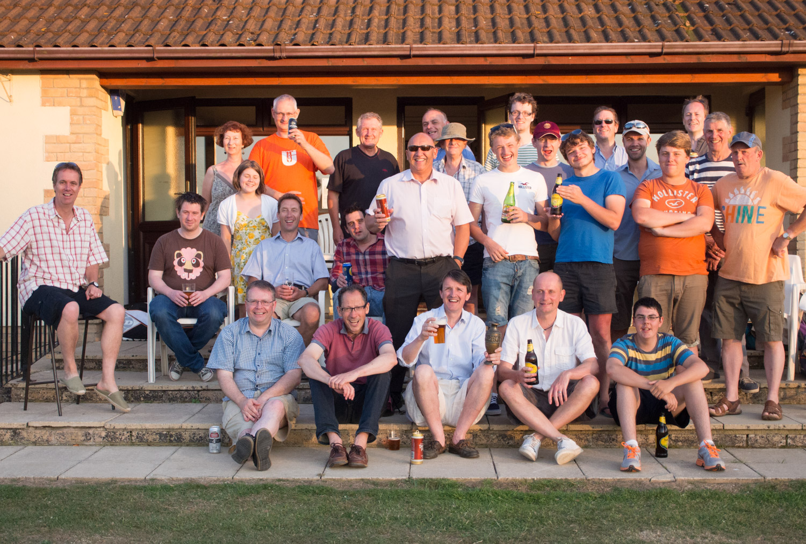



## The Min Innings

| Batsman | Dismissal |  | Runs |
|:---|:---|---|---:|
| **R Earney** | c G Field | B Pye | 36 |
| **R Beswick &#42;** | b | G Field | 38 |
| **E Ingham** | c M Pye | H Payne | 7 |
| **T Rutherford** | c D Garland | J Entwhistle | 55 |
| **W Calvert** | lbw | D Lowman | 1 |
| **J Grant &#8224;** | b | J Larkman | 40 |
| **A Slight** | not out |  | 4 |
| **J Purefoy** | not out |  | 3 |
| **P Wigg** | dnb |  |  |
| **E Garland** | dnb |  |  |
| **J Wright** | dnb |  |  |
| **Extras** | | (9b 4lb 12w 0nb 0p) | **25** |
| **Total** | | (40 overs) | **209 for 6 wkts** |

## Fall of Wickets

| | 1 | 2 | 3 | 4 | 5 | 6 | 7 | 8 | 9 | 10 |
|---|:---:|:---:|:---:|:---:|:---:|:---:|:---:|:---:|:---:|:---:|
| **Score** | 70 | 82 | 120 | 127 | 197 | 203 |  |  |  |  |
| **Batsman** | 1 | 3 | 2 | 5 | 4 | 6 |  |  |  |  |

## Bowling

| | O | M | R | W |
|---|:---|:---|:---|:---|
| **J Larkman** | 8 | 2 | 25 | 1 |
| **J Entwhistle** | 8 | 1 | 39 | 1 |
| **H Payne** | 8 | 0 | 40 | 1 |
| **B Bye** | 8 | 1 | 37 | 1 |
| **D Lowman** | 5 | 0 | 33 | 1 |
| **G Field** | 3 | 0 | 22 | 1 |

## {{page.title}} Innings

| Batsman | Dismissal |  | Runs |
|:---|:---|---|---:|
| **D Cook** | c & b | R Earney | 3 |
| **D Lowman** | st J Grant | J Wright | 28 |
| **J Larkman** | lbw | R Beswick | 26 |
| **D Garland &#42;** | lbw | J Wright | 0 |
| **G Field** | st J Grant | J Wright | 56 |
| **M Pye &#8224;** | run out |  | 8 |
| **M Grabham** | run out |  | 7 |
| **T Baigent** | c J Wright | R Earney | 32 |
| **H Payne** | b | E Garland | 10 |
| **J Entwhistle** | not out |  | 9 |
| **B Pye** | b | A Slight | 0 |
| **Extras** | | (0b 2lb 5w 0nb 0p) | **7** |
| **Total** | | (38.3 overs) | **186 for 6 wkts** |

## Fall of Wickets

| | 1 | 2 | 3 | 4 | 5 | 6 | 7 | 8 | 9 | 10 |
|---|:---:|:---:|:---:|:---:|:---:|:---:|:---:|:---:|:---:|:---:|
| **Score** | 7 | 60 | 60 | 63 | 118 | 130 | 139 | 153 | 182 | 186 |
| **Batsman** | 1 | 2 | 3 | 4 | 5 | 7 | 6 | 9 | 8 | 11 |

## Bowling

| | O | M | R | W |
|---|:---|:---|:---|:---|
| **P Wigg** | 8 | 4 | 32 | 0 |
| **R Earney** | 6 | 0 | 29 | 2 |
| **R Beswick** | 8 | 0 | 35 | 2 |
| **J Wright** | 8 | 1 | 57 | 3 |
| **E Garland** | 8 | 2 | 28 | 0 |
| **A Slight** | 0.3 | 0 | 3 | 1 |

## Win/Loss Ratio

| Won | Lost | Drawn | Tied |
|:---|:---|:---|---:|
| 4 | 3 | 2 | 0 |

