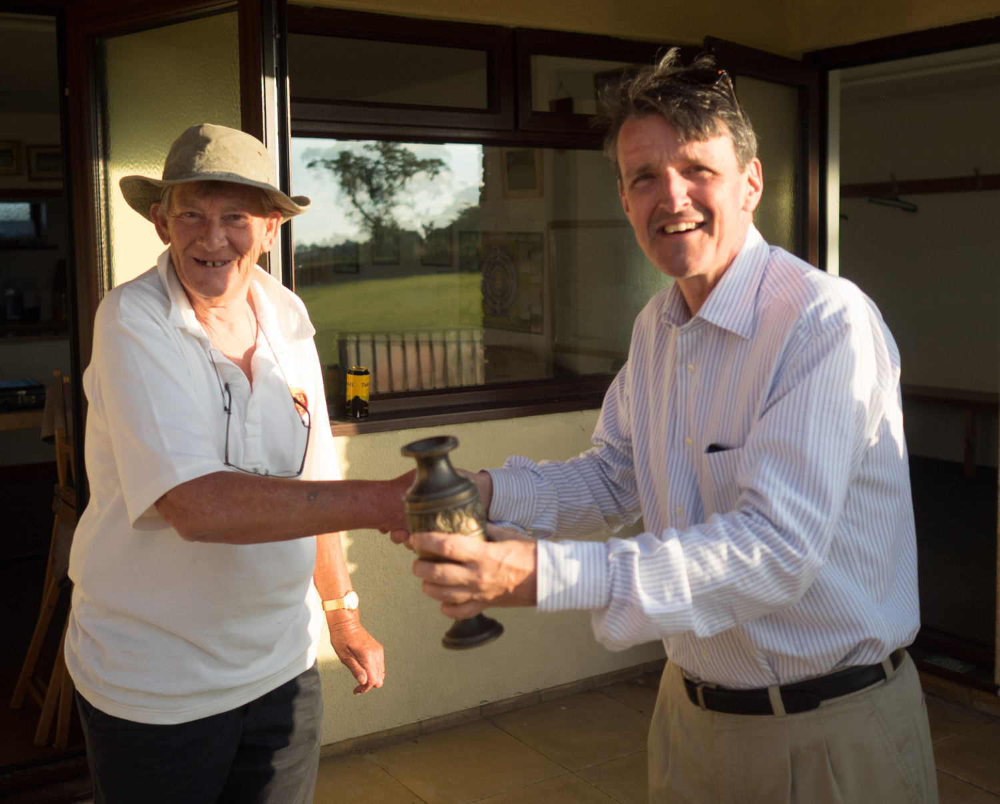



M Gupta's 10th 50

## The Min Innings

| Batsman | Dismissal |  | Runs |
|:---|:---|---|---:|
| **R Earney** | c D Garland | S Taylor | 9 |
| **S Barrowcliff** | c C Medland | B Pye | 22 |
| **R Beswick &#42;** | lbw | B Pye | 40 |
| **M Gupta** | b | S Taylor | 62 |
| **W Calvert** | b | M Derham | 1 |
| **R Coyle** | run out |  | 5 |
| **J Purefoy** |run out |  | 10 |
| **T Rutherford** | not out |  | 21 |
| **J Grant &#8224;** | not out |  | 4 |
| **P Wigg** | dnb |  |  |
| **J Wright** |dnb |  |  |
| **Extras** | | (7b 3lb 9w 3nb 0p) | **22** |
| **Total** | | (40 overs) | **198 for 7 wkts** |

## Fall of Wickets

| | 1 | 2 | 3 | 4 | 5 | 6 | 7 | 8 | 9 | 10 |
|---|:---:|:---:|:---:|:---:|:---:|:---:|:---:|:---:|:---:|:---:|
| **Score** | 12 | 53 | 93 | 144 | 157 | 165 | 194 |  |  |  |
| **Batsman** | 1 | 2 | 3 | 5 | 4 | 6 | 7 |  |  |  |

## Bowling

| | O | M | R | W |
|---|:---|:---|:---|:---|
| **S Taylor** | 8 | 1 | 26 | 2 |
| **J Payne** | 4 | 0 | 16 | 0 |
| **B Pye** | 8 | 1 | 19 | 2 |
| **C Medland** | 3 | 0 | 23 | 0 |
| **D Lowman** | 6 | 0 | 32 | 0 |
| **M Pye** | 2 | 0 | 10 | 0 |
| **D Cook** | 3 | 0 | 22 | 0 |
| **C Redman** | 1 | 0 | 14 | 0 |
| **J Norman** | 3 | 0 | 17 | 1 |
| **M Derham** | 2 | 0 | 9 | 1 |

## {{page.title}} Innings

| Batsman | Dismissal |  | Runs |
|:---|:---|---|---:|
| **D Cook** | c J Grant | P Wigg | 6 |
| **C Redman** | b | P Wigg | 5 |
| **C Medland** | c J Grant | P Wigg | 0 |
| **M Derham** | b | R Earney | 1 |
| **D Lowman &#8224;** | b | T Rutherford | 42 |
| **J Norman** | run out (M Gupta/R Earney) |  | 7 |
| **D Garland** | lbw | J Wright | 19 |
| **J Payne** | b | J Wright | 0 |
| **M Pye** | lbw | T Rutherford | 3 |
| **S Taylor** | b | S Barrowcliff | 0 |
| **B Pye** | not out |  | 0 |
| **Extras** | | (9b 1lb 4w 0nb 0p) | **14** |
| **Total** | | (23.2 overs) | **102 all out** |

## Fall of Wickets

| | 1 | 2 | 3 | 4 | 5 | 6 | 7 | 8 | 9 | 10 |
|---|:---:|:---:|:---:|:---:|:---:|:---:|:---:|:---:|:---:|:---:|
| **Score** | 10 | 11 | 12 | 16 | 41 | 83 | 83 | 89 | 99 | 102 |
| **Batsman** | 1 | 2 | 4 | 3 | 6 | 7 | 8 | 5 | 9 | 10 |

## Bowling

| | O | M | R | W |
|---|:---|:---|:---|:---|
| **P Wigg** | 6 | 2 | 16 | 3 |
| **R Earney** | 5 | 0 | 23 | 1 |
| **M Gupta** | 4 | 0 | 27 | 0 |
| **J Wright** | 4 | 0 | 10 | 2 |
| **T Rutherford** | 2 | 1 | 11 | 2 |
| **W Calvert** | 2 | 0 | 3 | 0 |
| **S Barrowcliff** | 0.2 | 0 | 2 | 1 |

## Win/Loss Ratio

| Won | Lost | Drawn | Tied |
|:---|:---|:---|---:|
| 5 | 1 | 1 | 0 |

