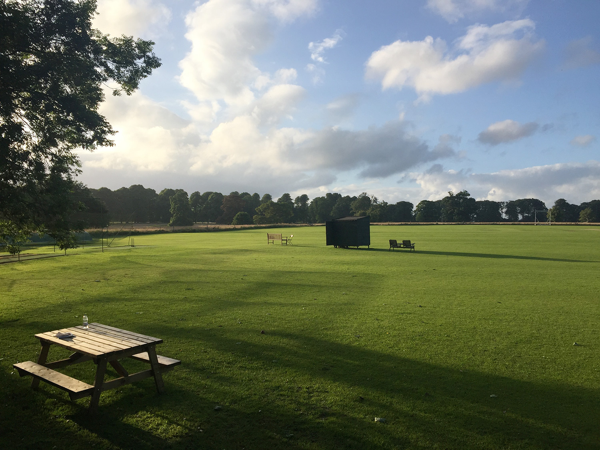



R Beswick's 32nd 50

## The Min Innings

| Batsman | Dismissal |  | Runs |
|:---|:---|---|---:|
| **R Beswick &#42;** | lbw | J Lennane | 61 |
| **R Earney** | run out |  | 23 |
| **M Gupta** | hit wkt | S Gillat | 28 |
| **A Beswick** | run out |  | 37 |
| **A Gallagher** | b | D French | 37 |
| **P Wigg** | b | T Barton | 42 |
| **H Ingham** | not out |  | 12 |
| **J Grant &#8224;** | not out |  | 3 |
| **K Gallagher** | dnb |  |  |
| **E Garland** | dnb |  |  |
| **J Wright** | dnb |  |  |
| **Extras** | | (2b 4lb 10w 1nb 0p) | **17** |
| **Total** | | (40 overs) | **260 for 4 wkts** |

## Fall of Wickets

| | 1 | 2 | 3 | 4 | 5 | 6 | 7 | 8 | 9 | 10 |
|---|:---:|:---:|:---:|:---:|:---:|:---:|:---:|:---:|:---:|:---:|
| **Score** | 29 | 89 | 156 | 172 | 242 | 253 |  |  |  |  |
| **Batsman** | 2 | 3 | 4 | 1 | 5 | 6 |  |  |  |  |

## Bowling

| | O | M | R | W |
|---|:---|:---|:---|:---|
| **D French** | 8 | 0 | 49 | 1 |
| **E Wakeley** | 6 | 1 | 38 | 0 |
| **S Gillat** | 8 | 0 | 50 | 1 |
| **R Cuthbert** | 7 | 0 | 37 | 0 |
| **J Lennane** | 4 | 0 | 30 | 1 |
| **B Vellacott** | 4 | 0 | 32 | 0 |
| **T Barton** | 3 | 0 | 18 | 1 |

## {{page.title}} Innings

| Batsman | Dismissal |  | Runs |
|:---|:---|---|---:|
| **N Knight** | c | H Ingham | 22 |
| **E Buxton** | lbw | H Ingham | 24 |
| **R Rose &#42;  &#8224;** | b | E Garland | 67 |
| **T Barton** | not out |  | 114 |
| **S Gillat** | c J Grant | K Gallagher | 50 |
| **J Lapham** | not out |  | 13 |
| **E Wakeley** | dnb |  |  |
| **B Vellacott** | dnb |  |  |
| **J Lennane** | dnb |  |  |
| **R Cuthbert** | dnb |  |  |
| **D French** | dnb |  |  |
| **Extras** | | (8b 1lb 8w 0nb 0p) | **17** |
| **Total** | | (37.4 overs) | **262 for 4 wkts** |

## Fall of Wickets

| | 1 | 2 | 3 | 4 | 5 | 6 | 7 | 8 | 9 | 10 |
|---|:---:|:---:|:---:|:---:|:---:|:---:|:---:|:---:|:---:|:---:|
| **Score** | 33 | 34 |  |  |  |  |  |  |  |  |
| **Batsman** | 2 | 1 |  |  |  |  |  |  |  |  |

## Bowling

| | O | M | R | W |
|---|:---|:---|:---|:---|
| **H Ingham** | 8 | 1 | 35 | 2 |
| **P Wigg** | 4 | 0 | 32 | 0 |
| **E Garland** | 5 | 0 | 31 | 1 |
| **J Wright** | 8 | 0 | 53 | 0 |
| **M Gupta** | 3 | 0 | 28 | 0 |
| **K Gallagher** | 7 | 0 | 51 | 1 |
| **R Beswick** | 2 | 0 | 12 | 0 |
| **A Gallagher** | 0.4 | 0 | 7 | 0 |

## Win/Loss Ratio

| Won | Lost | Drawn | Tied |
|:---|:---|:---|---:|
| 5 | 4 | 0 | 0 |

