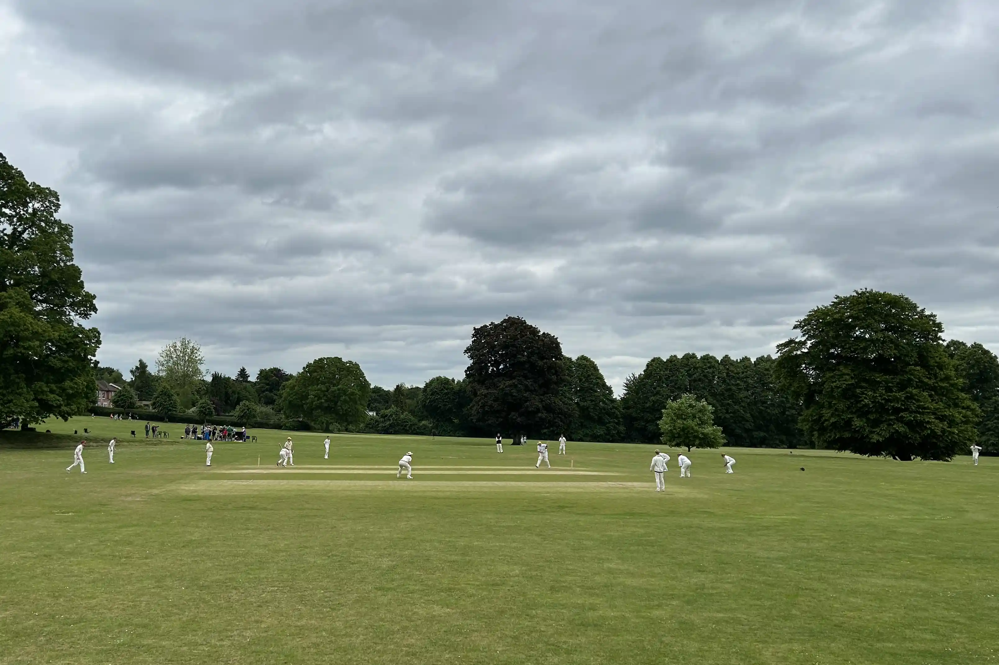



[Partnership](../records/partnerships) of 103 between A Beswick (47) and R Earney (35)

<iframe title="vimeo-player" src="https://player.vimeo.com/video/999084492" width="640" height="360" frameborder="0" allowfullscreen></iframe>

## {{page.homeTeam}} Innings

| Batsman | Dismissal | | Runs |
|:---|:---|---|---:|
| **R Doran** | b | P Wigg | 0 |
| **F Mayes** |  c A Beswick | C Etheridge | 21 |
| **M Taylor &#8224;** | c J Grant | P Wigg | 19 |
| **D Lambert** | lbw | J Carroll | 32 |
| **S Dibdin** | b  | J Stacey | 25 |
| **C Doran** | b | J Carroll | 4 |
| **M Findlay** | c W Calvert | R Earneyl | 20 |
| **M Shine** | b | H Owen | 22 |
| **M Andreanelli** | c & b | R Earney | 4 |
| **D Irvine** | not out |  | 1 |
| **T Arnold** | not out |  | 5 |
| **Extras** | | (5 0lb 9w 3nb 0p) | **17** |
| **Total** | | (35 overs) | **170 for 9 wkts** |

## Fall of Wickets

| | 1 | 2 | 3 | 4 | 5 | 6 | 7 | 8 | 9 | 10 |
|---|:---:|:---:|:---:|:---:|:---:|:---:|:---:|:---:|:---:|:---:|
| **Score** | 0 | 47 | 51 | 97 | 102 | 123 | 154 | 164 | 164 |  |
| **Batsman** | 1  | 3  | 2 | 4 | 6 | 5 | 7 | 9 | 8 |

## Bowling

| | O | M | R | W |
|---|:---|:---|:---|:---|
| **P Wigg** | 7 | 2 | 32 | 2 |
| **H Owen** | 7 | 1 | 35 | 1 |
| **C Etheridge** | 4 | 0 | 24 | 1 |
| **C Wright** | 6 | 0 | 25 | 0 |
| **J Carroll** | 7 | 1 | 29 | 2 |
| **J Stacey** | 2 | 0 | 13 | 1 |
| **R Earney** | 2 | 0 | 7 | 2 |

## {{page.awayTeam}} Innings

| Batsman | Dismissal | | Runs |
|:---|:---|---|---:|
| **A Beswick &#42;** | b | M Shine | 47 |
| **R Beswick** | c M Findlay | T Arnold | 4 |
| **R Earney** | c F Mayes | M Findlay | 35 |
| **[J Stacey](../profiles/jack-stacey)** | c D Irvine | R Doran | 43 |
| **J Carroll** | not out |  | 21 |
| **W Calvert** | not out |  | 0 |
| **C Etheridge** | dnb |  |  |
| **C Wright** | dnb |  |  |
| **J Grant &#8224;** | dnb |  |  |
| **P Wigg** | dnb |  |  |
| **H Owen** | dnb |  |  |
| **Extras** | | (2b 1lb 19w 1nb 0p) | **23** |
| **Total** | | (27.2 overs) | **173 for 4 wkts** |

## Fall of Wickets

| | 1 | 2 | 3 | 4 | 5 | 6 | 7 | 8 | 9 | 10 |
|---|:---:|:---:|:---:|:---:|:---:|:---:|:---:|:---:|:---:|:---:|
| **Score** | 5 | **108** | 116 | 169 | 129 | 132 | 164 | 164 | 172 |  |
| **Batsman** | 2 | 1 | 3 | 4 |  |  |  |  |  |  | 

## Bowling

| | O | M | R | W |
|---|:---|:---|:---|:---|
| **T Arnold** | 5 | 0 | 29 | 1 |
| **D Irvine** | 4 | 0 | 20 | 0 |
| **M Shine** | 5 | 1 | 28 | 1 |
| **C Doran** | 4 | 0 | 37 | 0 |
| **M Findlay** | 4 | 1 | 13 | 1 |
| **M Andreanelli** | 4.2 | 0 | 42 | 0 |
| **R Doran** | 1 | 0 | 1 | 1 |
| **T Mitchell** | 5 | 0 | 23 | 1 |
| **D Ramani** | 1.1 | 0 | 12 | 1 |

## Win/Loss Ratio

| Won | Lost | Drawn | Tied |
|:---|:---|:---|---:|
| 4 | 0 | 0 | 0 |

