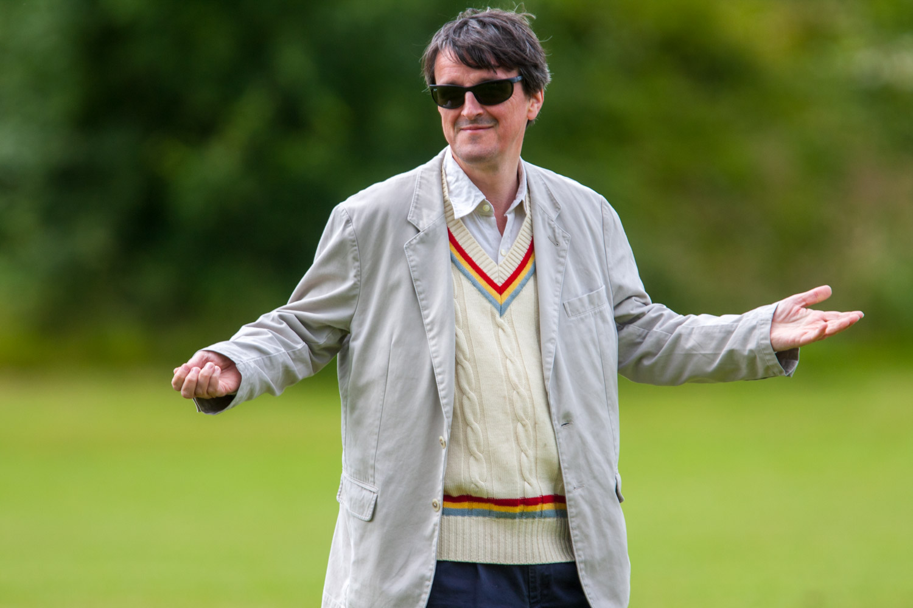
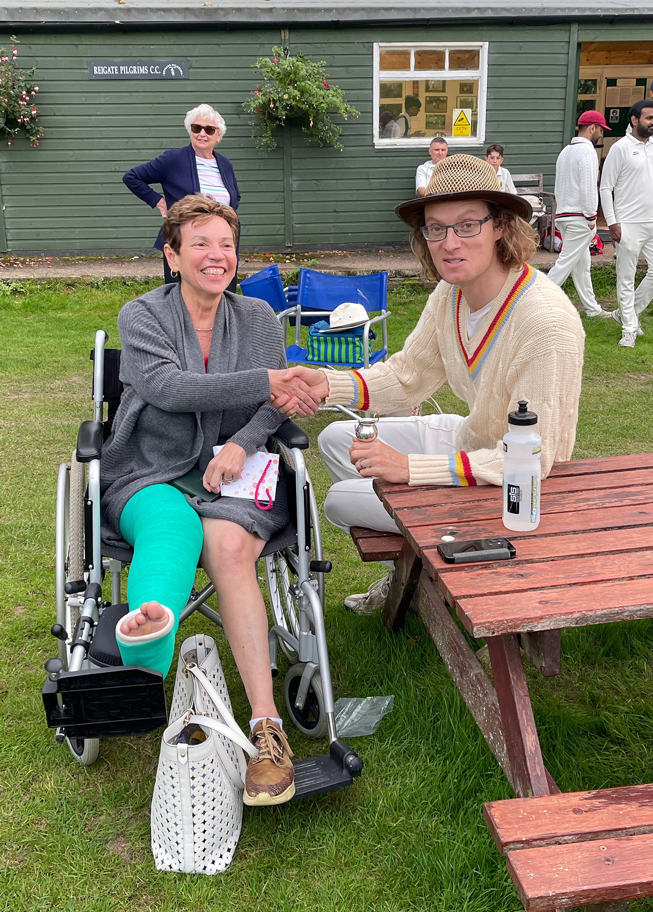

# {{page.title}}

This cup in honour of the late Jerry Wright is presented to the Min Cricketer of the Year. 

The player chosen will have at some point in the season put the ball "on the noggin" or will have "run 'em up"

| Year | Player |
|:---|:---|
| 2024 | Alf Beswick |
| 2023 | Richard Earney |
| 2022 | Alf Beswick |
| 2021 | Partick Wigg |

## Other Awards 2024

### Highly commended: 

 - Anand for match-winning innings v Trinity; 
 - Chris four-four in Ashes and in fact everyone who turned up all season.
 - Jim for long-service to glovemanship
 
### Main Awards

Pull of the Season: *Imran Ali* (useful and keen)

Performance of the Season: *Danny Padala* for denting a BMW (oh and the fantastic 100 that came with it!!)

Player of the Season and winner of the Jerry Wright Cup: *Alf Beswick* 341 runs at 56.83, a Hundred and 2 x Fifties, Catches and a winning season as captain